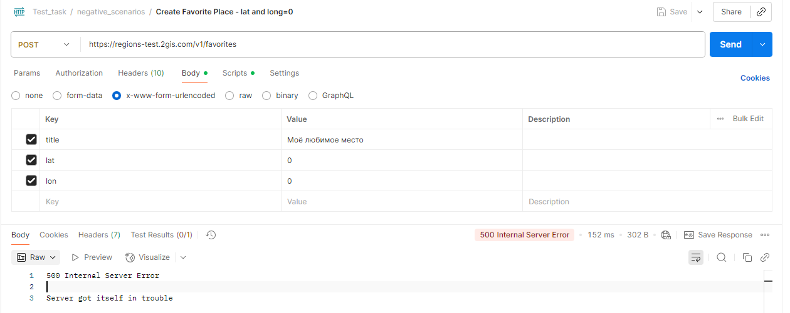

# 🐞 Баг-репорт: BUG_FAV_001
**Название:** Ошибка 500 при создании избранного места с координатами lat=0, lon=0  

**Сообщил:** имя  
**Дата:** 2025-09-05  
**Серьёзность (Severity):** Major  
**Приоритет (Priority):** Низкий  
**Статус:** Open  

---

### 🛠 Окружение

- API: [https://regionstest.2gis.com/v1/favorites](https://regionstest.2gis.com/v1/favorites)  
- Версия API: v1  
- ОС: Windows 10  
- Инструмент: Postman / Python (requests)  

---

### 📝 Описание

При отправке POST-запроса на создание избранного места с координатами `lat=0` и `lon=0` сервер возвращает ошибку 500 (Internal Server Error).  
Ожидаемое поведение: сервер должен корректно обработать координаты и создать место.  

---

### 📋 Предусловия

- Получен валидный токен через `POST https://regions-test.2gis.com/v1/auth/tokens`  

---

### 🔁 Шаги воспроизведения

1. Отправить запрос `POST https://regions-test.2gis.com/v1/favorites`  
   - Body (Формат тела: x-www-form-urlencoded):  
     - title = Моё любимое место  
     - lat = 0  
     - lon = 0  
   - Заголовки:  
     - Content-Type: application/x-www-form-urlencoded  
     - Cookie: token=<valid_token> (получен из предусловия)  

---

### ✅ Ожидаемый результат

- Место успешно создаётся с координатами (0,0)  

---

### ❌ Фактический результат

- Сервер возвращает HTTP 500 Internal Server Error  

---

### 📎 Вложения

**Скриншот ответа 500 Internal Server Error:**  

---

### 💬 Дополнительные примечания

- Координаты (0,0) являются валидными и соответствуют пересечению экватора и Гринвичского меридиана  
- Ошибка воспроизводится стабильно как через Postman, так и при отправке запроса с помощью Python (библиотека requests).
