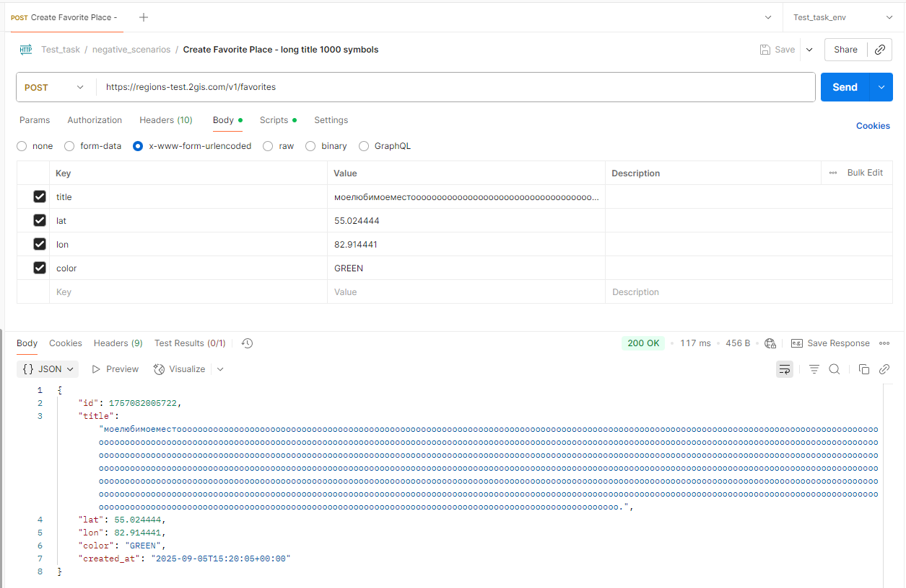

# 🐞 Баг-репорт: BUG_FAV_002
**Название:** Неверный лимит символов в поле title (от 1 до 999 заявлено, 1000 принимается)

**Сообщил:** имя  
**Дата:** 2025-09-05  
**Серьёзность (Severity):** Minor  
**Приоритет (Priority):** Низкий  
**Статус:** Open  

---

### 🛠 Окружение

- API: [https://regionstest.2gis.com/v1/favorites](https://regionstest.2gis.com/v1/favorites)  
- Версия API: v1  
- ОС: Windows 10  
- Инструмент: Postman / Python (requests)   

---

### 📝 Описание

Согласно документации поле title должно содержать от 1 до 999 символов, однако при передаче строки длиной 1000 символов сервер возвращает код HTTP 200 OK и успешно создаёт место.

---

### 📋 Предусловия

- Получен валидный токен через `POST https://regions-test.2gis.com/v1/auth/tokens`  

---

### 🔁 Шаги воспроизведения

1. Отправить запрос `POST https://regions-test.2gis.com/v1/favorites`  
   - Body (Формат тела: x-www-form-urlencoded):  
     - title = строка длиной 1000 символов  
     - lat = 55.454676  
     - lon = 37.887756
   - Заголовки:  
     - Content-Type: application/x-www-form-urlencoded  
     - Cookie: token=<valid_token> (получен из предусловия)  

---

### ✅ Ожидаемый результат

Сервер должен соблюдать ограничение title ≤ 999 и при его превышении возвращать 400 Bad Request с информативным JSON-ответом, содержащим:
```
{
  "error": {
    "id": "<уникальный UUID ошибки>",
    "message": "Параметр 'title' должен содержать не более 999 символов"
  }
}
```
---

### ❌ Фактический результат

Сервер возвращает HTTP 200 OK, место успешно создаётся.

---

### 📎 Вложения

**Скриншот ответа 200 OK:**  

---

### 💬 Дополнительные примечания

- При title = 1001 сервер возвращает HTTP 400 Bad Request с id ошибки и сообщением: "Параметр 'title' должен содержать не более 999 символов"
- Ошибка воспроизводится стабильно как через Postman, так и при отправке запроса с помощью Python (библиотека requests).
