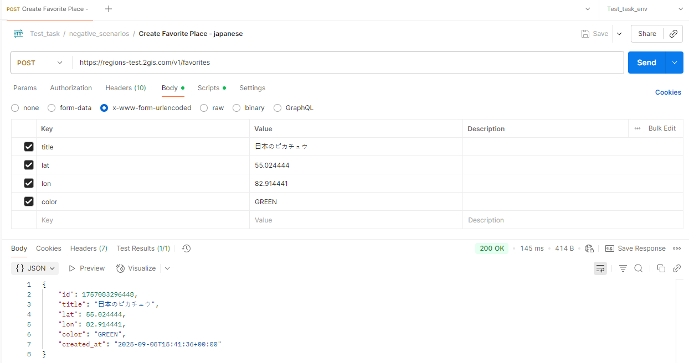
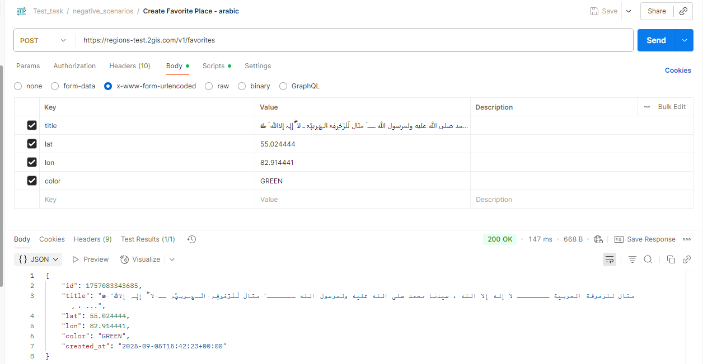

# 🐞 Баг-репорт: BUG_FAV_003
**Название:** Принимаются японские и арабские символы в поле title

**Сообщил:** имя  
**Дата:** 2025-09-05  
**Серьёзность (Severity):** Minor  
**Приоритет (Priority):** Низкий  
**Статус:** Open  

---

### 🛠 Окружение

- API: [https://regionstest.2gis.com/v1/favorites](https://regionstest.2gis.com/v1/favorites)  
- Версия API: v1  
- ОС: Windows 10  
- Инструмент: Postman / Python (requests)  

---

### 📝 Описание

В документации указано, что поле title может содержать латинские и кириллические символы, цифры и знаки препинания, с длиной от 1 до 999 символов.

Фактически сервер принимает также японские, арабские и другие символы, что выходит за рамки заявленных ограничений.

---

### 📋 Предусловия

- Получен валидный токен через `POST https://regions-test.2gis.com/v1/auth/tokens`  

---

### 🔁 Шаги воспроизведения

1. Отправить запрос `POST https://regions-test.2gis.com/v1/favorites`  
   - Body (Формат тела: x-www-form-urlencoded):  
     - title = строка с японскими или арабскими символами (например: "こんにちは" или "مرحبا") 
     - lat = 55.454676  
     - lon = 37.887756
   - Заголовки:  
     - Content-Type: application/x-www-form-urlencoded  
     - Cookie: token=<valid_token> (получен из предусловия)  

---

### ✅ Ожидаемый результат

Сервер должен принимать только латинские, кириллические символы, цифры и знаки препинания.

Любые символы вне этого диапазона должны вызывать 400 Bad Request с понятным сообщением, например:
```json
{
  "error": {
    "id": "<UUID ошибки>",
    "message": "Параметр 'title' содержит недопустимые символы"
  }
}

```
---

### ❌ Фактический результат

Сервер принимает и успешно создаёт место с японскими или арабскими символами в поле title (HTTP 200 OK).

---

### 📎 Вложения

**Скриншот ответа 200 OK c японскими символами:**  


**Скриншот ответа 200 OK c арабскими символами:**  


---

### 💬 Дополнительные примечания

- Ошибка воспроизводится стабильно как через Postman, так и при отправке запроса с помощью Python (requests).
- Причина — сервер не ограничивает набор символов согласно документации.
