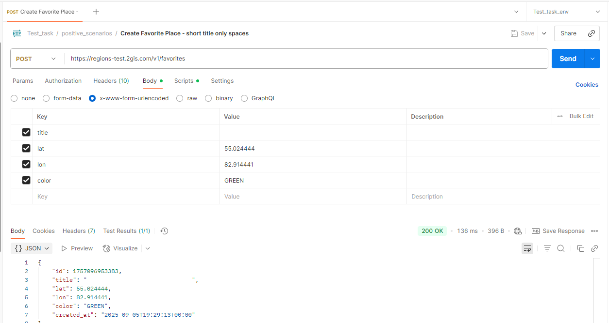

# 🐞 Баг-репорт: BUG_FAV_004
**Название:** Поле title, состоящее только из пробелов, создаёт место успешно  

**Сообщил:** имя  
**Дата:** 2025-09-05  
**Серьёзность (Severity):** Major  
**Приоритет (Priority):** Средний  
**Статус:** Open  

---

### 🛠 Окружение

- API: [https://regionstest.2gis.com/v1/favorites](https://regionstest.2gis.com/v1/favorites)  
- Версия API: v1  
- ОС: Windows 10  
- Инструмент: Postman / Python (requests)  

---

### 📝 Описание

В документации указано, что поле `title` должно содержать хотя бы один символ (латинский или кириллический, цифру или знак препинания).  

Фактически сервер принимает строку, состоящую только из пробелов, и создаёт место, возвращая HTTP 200 OK, что нарушает требование минимальной длины и корректности значения поля.  

---

### 📋 Предусловия

- Получен валидный токен через `POST https://regions-test.2gis.com/v1/auth/tokens`  

---

### 🔁 Шаги воспроизведения

1. Отправить запрос `POST https://regions-test.2gis.com/v1/favorites`  
   - Body (Формат тела: x-www-form-urlencoded):  
     - title = `"     "` (строка только с пробелами)  
     - lat = 55.028254  
     - lon = 82.918501  
   - Заголовки:  
     - Content-Type: application/x-www-form-urlencoded  
     - Cookie: token=<valid_token> (получен из предусловия)  

---

### ✅ Ожидаемый результат

Сервер должен вернуть HTTP 400 Bad Request с сообщением, например:  
```json
{
"error": {
"id": "<UUID ошибки>",
"message": "Параметр 'title' пустой или содержит только пробелы"
}
}
```

---

### ❌ Фактический результат

Сервер принимает строку из пробелов и **успешно создаёт место** (HTTP 200 OK).  

---

### 📎 Вложения

**Скриншот ответа 200 OK для title = "     ":**  


---

### 💬 Дополнительные примечания

- Ошибка воспроизводится стабильно как через Postman, так и через Python (requests).  
- Причина — сервер не проверяет, что `title` содержит хотя бы один видимый символ; пробелы считаются допустимыми и не игнорируются, поэтому строка из одних пробелов проходит проверку.
