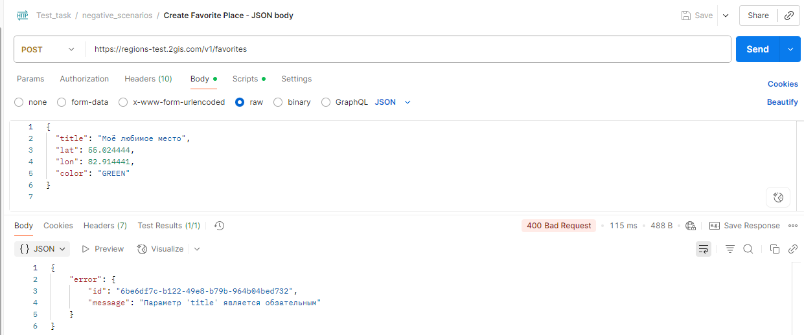
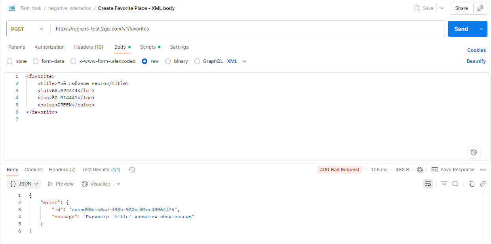

# 🐞 Баг-репорт: BUG_FAV_005
**Название:** Некорректное сообщение об ошибке при отправке JSON вместо form-urlencoded (или form-data)

**Сообщил:** имя  
**Дата:** 2025-09-05  
**Серьёзность (Severity):** Major  
**Приоритет (Priority):** Средний  
**Статус:** Open  

---

### 🛠 Окружение

- API: [https://regionstest.2gis.com/v1/favorites](https://regionstest.2gis.com/v1/favorites)  
- Версия API: v1  
- ОС: Windows 10  
- Инструмент: Postman / Python (requests)  

---

### 📝 Описание

Сервер ожидает application/x-www-form-urlencoded или multipart/form-data.
При отправке тела запроса в формате JSON (application/json) сервер возвращает 400 Bad Request, но сообщение об ошибке указывает на отсутствие обязательного поля title, вместо того чтобы указать некорректный формат тела запроса.

Суть бага: сначала должна проверяться валидность Content-Type, а затем уже содержимое полей.

---

### 📋 Предусловия

- Получен валидный токен через `POST https://regions-test.2gis.com/v1/auth/tokens`  

---

### 🔁 Шаги воспроизведения

1. Отправить запрос `POST https://regions-test.2gis.com/v1/favorites`  
   - Body (raw JSON):  
```json
{
  "title": "My favorite place",
  "lat": 55.028254,
  "lon": 82.918501,
  "color": "GREEN"
}
```
   - Заголовки:  
     - Content-Type: application/json
     - Cookie: token=<valid_token> (получен из предусловия)  

---

### ✅ Ожидаемый результат

Сервер возвращает HTTP 400 Bad Request с сообщением о некорректном формате тела запроса, например:

```json
{
  "error": {
    "id": "<UUID ошибки>",
    "message": "Некорректный формат тела запроса. Ожидаемый Content-Type: application/x-www-form-urlencoded или multipart/form-data"
  }
}
```

---

### ❌ Фактический результат

Сервер возвращает 400 Bad Request, но сообщение об ошибке указывает, что отсутствует обязательное поле title, вместо корректного уведомления о неверном формате тела запроса.

---

### 📎 Вложения

**Скриншот ответа 400 с ошибкой: "Параметр 'title' является обзательным" при некорректном формате тела (JSON)**  


**Скриншот ответа 400 с ошибкой: "Параметр 'title' является обзательным" при некорректном формате тела (XML)**  


---

### 💬 Дополнительные примечания

- Ошибка воспроизводится стабильно как через Postman, так и через Python (requests).
- Причина — сервер не проверяет тип тела запроса до проверки полей, поэтому сообщение об ошибке вводит в заблуждение.
- Правильная логика: сначала проверять Content-Type, затем — содержимое полей.
